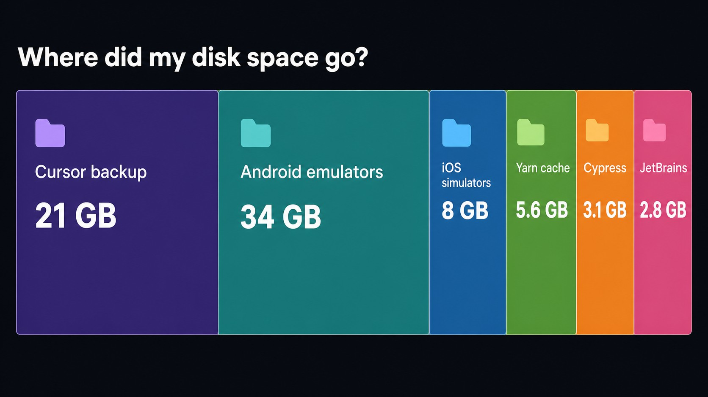
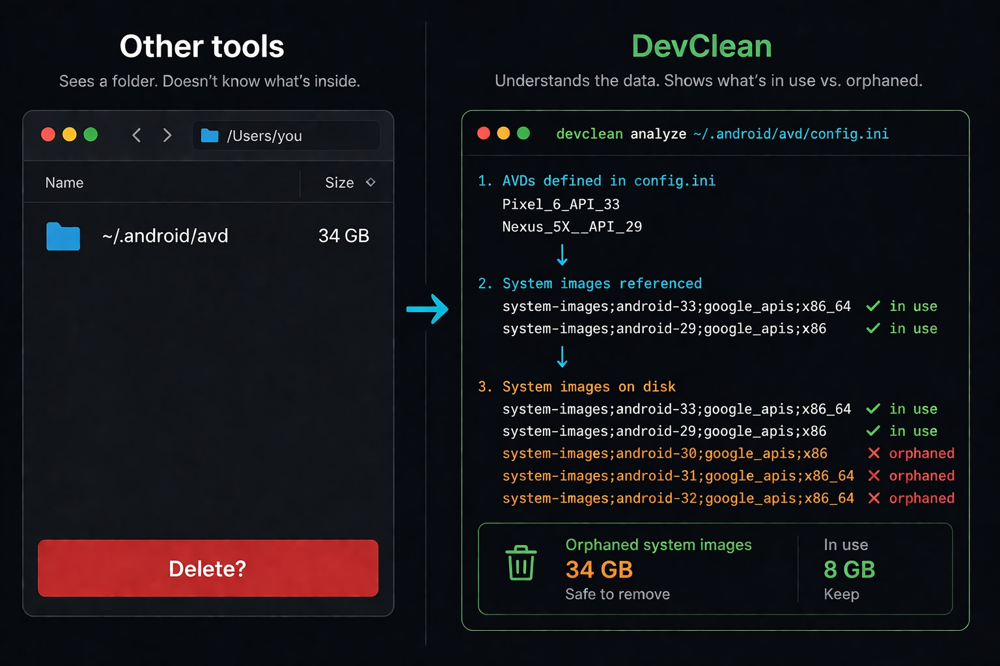
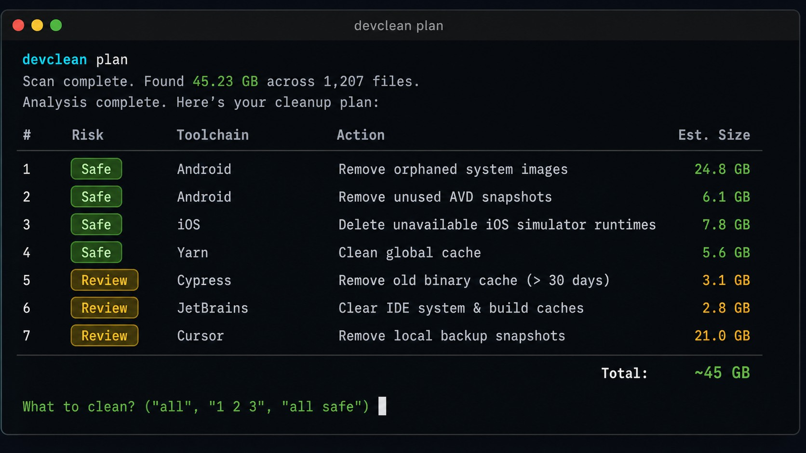

# I Freed 45 GB of Dev Disk Space With One Claude Code Command

Last week, my MacBook told me I had 14 GB of free space. I'm running a 512 GB drive. Where did it all go?

I opened Finder, sorted by size, and found the usual suspects — but what shocked me was *where* the bloat actually lived. Not in my Downloads folder. Not in forgotten video files. It was hiding inside developer tools I use every single day.

Cursor's `state.vscdb.backup` file alone was **21 GB**. One file. A SQLite backup from my code editor.

That kicked off a deep dive that changed how I think about developer workstation maintenance — and ended with me building a tool to make sure I never have to do it manually again.

## The Hidden Cost of Being a Developer

Here's what I found when I actually looked:

| Category | Size | What it was |
|---|---|---|
| Cursor state backup | 21 GB | `state.vscdb.backup` — a single SQLite file |
| Android emulators | 34 GB | 3 AVDs + orphaned system images nobody was using |
| iOS simulators | ~8 GB | 36 devices across iOS 15.5, 16.0, 16.4, 18.0 — mostly duplicates |
| Yarn cache | 5.6 GB | Global package cache from hundreds of `yarn install` runs |
| Cypress cache | 3.1 GB | Old Electron binaries for end-to-end testing |
| JetBrains caches | 2.8 GB | IntelliJ/WebStorm index and log files |

**Total recovered: ~45 GB.**



And this isn't unusual. If you're a mobile developer or full-stack engineer on macOS, you're probably sitting on 50-100 GB of dev tool bloat right now. You just don't know it because these files hide in `~/Library`, `~/.android`, and `~/Library/Developer/CoreSimulator` — places you never browse.

## Why Existing Tools Don't Cut It

I tried the obvious solutions first.

**CleanMyMac X** ($40/year) found some caches, but it treats developer tools as opaque blobs. It doesn't know that my three Android AVDs all target API 33 and share the same system image — or that two of them haven't been booted in six months. It just sees "big folder, want to delete?"

**DaisyDisk** is great at showing you *what's big*. But it has zero opinion on *what's safe to remove*. It'll happily show you that `~/.android/avd` is 34 GB, but the decision-making is entirely on you. Hope you remember which system images are still referenced by your AVD configs.

**DevCleaner for Xcode** covers exactly one tool — Xcode. It clears derived data and old device support files. Useful, but it doesn't touch your Android setup, your Node caches, or your IDE bloat.

Here's the fundamental problem: **these tools don't understand developer toolchains at a semantic level.**

They can't read an AVD's `config.ini` to figure out which system images are actively referenced and which are orphaned. They can't look at your iOS simulators and realize you have eight iPhone 14 Pro devices across four iOS versions when you only need one per version. They can't assess risk — will deleting this cache cost you a 20-minute rebuild, or is it completely safe?

I needed something smarter.



## Introducing DevClean

DevClean is a Claude Code skill that performs intelligent cleanup of your developer workstation across macOS, Linux, and Windows. It's not a compiled binary or an Electron app. It's an AI skill that runs inside Claude Code, which means it can actually *reason* about what it finds.

The workflow is straightforward:

```text
You: /devclean

DevClean: Scanning your development environment...

Found 7 cleanup opportunities across 5 categories:

 ANDROID EMULATORS                                    34.2 GB
 ├── AVD: Pixel_6_API_33          8.1 GB  (last booted: 2024-11-02)
 ├── AVD: Pixel_7_API_33          8.3 GB  (last booted: 2025-01-15)
 ├── AVD: Pixel_4_API_30          7.4 GB  (last booted: 2024-06-18)
 └── Orphaned system images       10.4 GB  (no AVD references these)

 iOS SIMULATORS                                        8.1 GB
 ├── iOS 15.5: 6 devices (recommend keep 1)
 ├── iOS 16.0: 8 devices (recommend keep 1)
 ├── iOS 16.4: 12 devices (recommend keep 1)
 └── iOS 18.0: 10 devices (recommend keep 1)

 IDE & EDITOR CACHES                                  23.8 GB
 ├── Cursor state.vscdb.backup    21.0 GB   [SAFE]
 └── JetBrains caches              2.8 GB   [SAFE]

 PACKAGE MANAGER CACHES                                8.7 GB
 ├── Yarn global cache             5.6 GB   [SAFE]
 └── Cypress binary cache          3.1 GB   [REBUILD: ~3-15 min]

Risk Legend:  [SAFE] = no rebuild cost
              [REBUILD: Xm] = will need re-download on next use
```

But the interesting part isn't the scan. It's what happens next.

## Intelligence, Not Just Inventory

When I told DevClean to clean up my iOS simulators, I said: "keep one representative device per iOS version." Here's what it presented:

```bash
You: Clean up the iOS simulators. Keep one per iOS version.

DevClean: Here's my plan:

 iOS 15.5 — keeping iPhone 13 Pro (most common test target)
           removing: iPhone 13, iPhone 13 mini, iPhone SE 3rd gen,
                     iPad Air 5th gen, iPad mini 6th gen

 iOS 16.0 — keeping iPhone 14 Pro
           removing: iPhone 14, iPhone 14 Plus, iPhone 14 Pro Max,
                     iPhone SE 3rd gen, iPad Air 5th gen,
                     iPad Pro 11-inch, iPad Pro 12.9-inch

 [... similar for iOS 16.4 and 18.0]

 Total simulators to remove: 32
 Estimated space freed: ~6.2 GB

 Proceed? [y/N]
```

This is the differentiator. DevClean doesn't just find big files. It makes **judgment calls** — the kind a senior developer would make — and explains its reasoning before touching anything.

For Android, it reads each AVD's `config.ini` to trace exactly which system images are in use. Only images with zero references get flagged as orphaned. It knows the difference between "this AVD uses API 33 x86_64" and "this system image for API 33 arm64-v8a is sitting here unused."

For package manager caches, it checks when each cache was last accessed and estimates rebuild cost. Deleting your Yarn cache is free — `yarn install` will re-download on next run. Deleting your Cypress cache means Electron binary re-download next time you run tests (roughly 3–15 minutes depending on version and connection speed). You should know that before you say yes.



## How It Works

A shell script can tell you a folder is 8 GB. It takes actual understanding of Android's emulator architecture to know that deleting `system-images/android-30/google_apis/x86_64` is safe because no AVD in `~/.android/avd/` references API 30 x86_64 anymore. That reasoning is what DevClean brings — Claude operating inside a sandboxed skill with explicit permissions and a module system that encodes domain knowledge for each toolchain.

## Getting Started

DevClean is a Claude Code skill, so setup takes about 30 seconds.

**Prerequisites:** You need [Claude Code](https://docs.anthropic.com/en/docs/claude-code) installed and working.

**Installation:**

```bash
# Clone the repo
git clone https://github.com/mohdashraf010897/devclean.git

# Copy the skill to your Claude Code skills directory
cp -r devclean/.claude/skills/devclean ~/.claude/skills/

# That's it. No build step, no dependencies.
```

**Usage:**

```bash
# Launch Claude Code in any directory
claude

# Run DevClean
/devclean
```

DevClean runs a full scan, presents everything it finds, and lets you pick what to clean. You can tell it things like "only clean the safe items" or "skip the Android stuff" — it's a conversation, not a CLI with flags. There's no `--force` mode.

## Current Limitations

- **It doesn't run on a schedule.** You invoke it when you want it. There's no background daemon.
- **Docker cleanup is conservative.** It scans Docker usage and offers `docker system prune`, but won't touch volumes without explicit confirmation due to data loss risk.
- **It requires Claude Code.** If you're not already using Claude Code as your AI coding assistant, this skill won't work standalone.

## What's Live + What's Next

**Currently shipped — 19 modules total:**
macOS, Linux, and Windows are all supported. Active modules include Android, iOS, Xcode, Node.js, Python, Rust, Java, .NET, Docker, Homebrew, JetBrains, Cursor, VS Code, browsers, Linux system caches, Windows system caches, Visual Studio, WSL2, and Windows package managers.

**On the roadmap:**
- **CI cache analysis** — connect to GitHub Actions or CircleCI caches and identify what's accumulating vs. what's being used
- **Workspace-aware cleanup** — tie recommendations to active projects; if you haven't opened a React Native project in 6 months, those specific emulator configs can probably go
- **Scheduled scans** — monthly cleanup reminders with delta reports showing what grew since last scan

## Try It

**[github.com/mohdashraf010897/devclean](https://github.com/mohdashraf010897/devclean)** — open source, free, MIT licensed.

If you're a developer on macOS, Linux, or Windows, run a quick scan. Most developers are surprised at what they find — I was sitting on 45 GB of recoverable space and had no idea.

If you find it useful, star the repo and share it with your team. If you find a bug or want to add a new cleanup category, PRs are welcome.

The best part about building this as a Claude Code skill rather than a traditional app: adding support for a new tool category doesn't require writing a parser. Describe the tool's file layout and configuration format, and the AI figures out the rest. That's a fundamentally different approach to developer tooling.

---

*Built by [Mohd Ashraf](https://github.com/mohdashraf010897). Questions or contributions — open an issue on the repo.*
